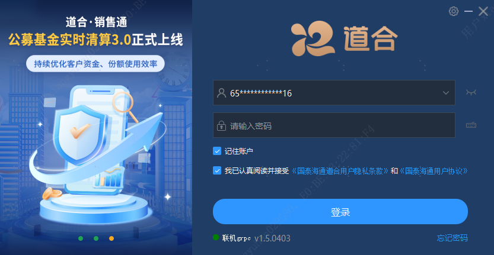
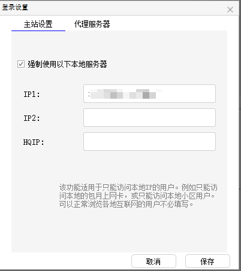
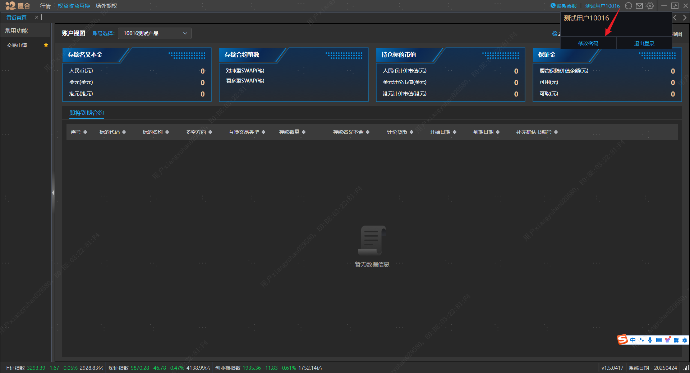
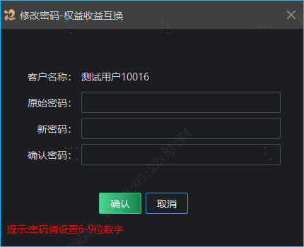

账户与登录
=====

登录
--

双击国泰海通道合系统图标，打开如下的登录界面。

**操作说明：**

*   输入账号和密码，待下方显示绿色圆点和联机字样后，点击登录；
*   点击右上角的按钮，可进行代理设置；

**注意事项：**

*   登录账号为657007开头，长度16位的资金账号。

修改密码
----

登录后，点击主界面右上角顶部的客户名称，在弹框中点击“修改密码”按钮可对当前登录账户的登陆密码进行修改。注意：密码修改需要输入原密码。首次交易密码重置还需临柜办理或告知项目经理代为重置。若由产品经理重置密码，为保证账户安全，客户首次在道合登录时会要求强制修改密码，修改后再用新的密码重新登录，进行操作和交易下单。此后正常登录，系统不再强制要求修改密码。

多账户登录与切换
--------

目前版本支持同时登录多个账户，支持多个账户间切换，并且支持切换时保留原界面打开菜单页及菜单页面输入的内容。点击客户端右上角“切换”按钮，展开如上图所示弹框区域，点击“添加账号”按钮，弹出登录框，输入账号密码后，即切换至新账户的操作界面。支持同时添加多个账户登录，点击“切换”按钮，可以切换至对应账户的操作界面，切换操作用户不影响原用户输入的内容。
