**道合客户端**

**用户使用说明**

**（对应版本2026-01-09）**

国泰海通证券股份有限公司

二零二六年一月

**目录**

1 概述 4

1.1 道合产品特点 4

2 账户与登录 4

2.1 登录 4

2.2 修改密码 5

2.3 多账户登录与切换 5

3 系统功能 6

3.1 首页与整体框架 6

3.1.1 顶部菜单栏 6

3.1.2 左侧常用功能目录区 6

3.1.3 菜单定时导出 6

3.1.4 详情页面区 7

3.2 单产品交易申请 7

3.2.1 股票交易操作 8

3.2.2 跨境期货交易操作 20

3.2.3 Hightouch模式 23

3.2.4 跨境期权交易操作 25

3.2.5 美股盘前交易 28

3.2.6 Compo模式交易 29

3.3 管理人交易申请 31

3.3.1 股票交易操作 31

3.3.2 Hightouch交易操作 35

3.3.3 美股盘前交易 37

3.3.4 Compo模式交易 37

3.4 成交分配 38

3.4.1 成交分配 39

3.4.2 成交分配记录查询 40

3.5 权益通交易申请 41

3.5.1 股票交易操作 42

3.5.2 Hightouch交易操作 45

3.5.3 美股盘前交易 46

3.5.4 Compo模式交易 47

3.6 权益通成交分配 48

3.6.1 成交分配 48

3.6.2 成交分配记录查询 50

3.7 批量交易申请 51

3.7.1 股票批量申请 51

3.7.2 期货批量交易 54

3.7.3 期权批量交易 55

3.8 收益互换出金申请 56

3.9 委托流水查询 62

3.10 管理人委托流水查询 63

3.11 权益通委托流水查询 64

3.12 历史成交查询 65

3.13 管理人历史成交查询 66

3.14 权益通历史成交查询 67

3.15 持仓合约查询 68

3.16 已终止合约查询 69

3.17 境外白名单查询 70

3.18 境内融券券池查询 71

3.19 出入金流水查询 72

3.20 合约开平仓查询 73

概述
==

道合产品特点
------

道合系统是国泰海通证券针对专业机构投资者设计开发的场外互换业务线上的交易终端。道合客户端包括了交易申请、多产品下单、批量交易申请等多种核心交易功能，提供了丰富的算法类型和下单策略等交易方式，并将这些功能封装在简洁明了的现代化界面中，能为投资者的决策带来全方位的支持和无缝的数字化体验。

账户与登录
=====

登录
--

双击国泰海通道合系统图标，打开如下的登录界面。

**操作说明：**

*   输入账号和密码，待下方显示绿色圆点和联机字样后，点击登录；
*   点击右上角的按钮，可进行代理设置；

**注意事项：**

*   登录账号为657007开头，长度16位的资金账号。

修改密码
----

登录后，点击主界面右上角顶部的客户名称，在弹框中点击“修改密码”按钮可对当前登录账户的登陆密码进行修改。注意：密码修改需要输入原密码。首次交易密码重置还需临柜办理或告知项目经理代为重置。若由产品经理重置密码，为保证账户安全，客户首次在道合登录时会要求强制修改密码，修改后再用新的密码重新登录，进行操作和交易下单。此后正常登录，系统不再强制要求修改密码。

多账户登录与切换
--------

目前版本支持同时登录多个账户，支持多个账户间切换，并且支持切换时保留原界面打开菜单页及菜单页面输入的内容。点击客户端右上角“切换”按钮，展开如上图所示弹框区域，点击“添加账号”按钮，弹出登录框，输入账号密码后，即切换至新账户的操作界面。支持同时添加多个账户登录，点击“切换”按钮，可以切换至对应账户的操作界面，切换操作用户不影响原用户输入的内容。

系统功能
====

首页与整体框架
-------

登陆后将进入到首页，如下图所示。界面顶部为菜单栏，左侧为常用功能目录区，右侧为详情页面区。

### 顶部菜单栏

顶部菜单栏包括：行情、权益收益互换、场外期权。

点击菜单中具体功能，会显示该功能的详情页面，并以标签页的形式显示在详情页面上方。

菜单支持收藏模式，点亮黄色星标进行收藏，收藏后该功能显示在左侧常用功能目录区中；再次点击星标取消收藏，取消收藏后该功能在常用功能目录中取消显示。

### 左侧常用功能目录区

通过菜单栏进行收藏或取消收藏，点击常用功能目录区右侧箭头可以进行折叠，再次点击该箭头进行展开。

### 菜单定时导出

点击右上角的按钮，打开系统设置弹框，点击君衍交易tab可以设置定时导出菜单及相关导出时间和文件存储路径。

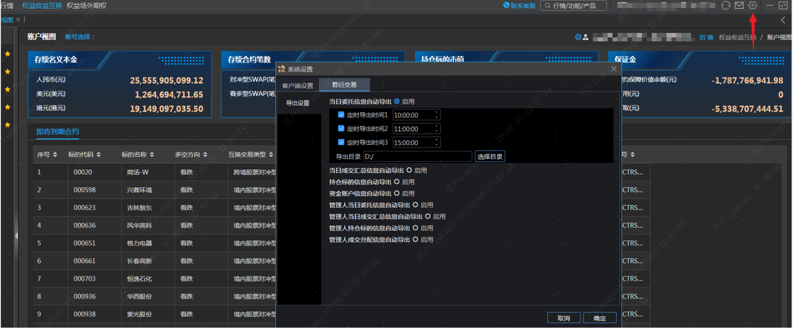

### 详情页面区

通过菜单栏或常用功能目录区打开详情页面，已打开的详情页面可以通过顶部标签进行切换。

单产品交易申请
-------

菜单：【权益收益互换】-【交易申请】

支持A股（含ETF）、港股(含ETF)、美股（含ETF）、日股（含ETF，限东京证券交易所）看多型开平仓和看空型开平仓、跨境期货（含香港股指和境外股指）看多型开平仓和看空型开平仓、跨境期权看多型开平仓和看空型开平仓。菜单整体如下所示。

### 股票交易操作

在菜单界面和交易界面分别选中股票tab，查询股票相关委托信息并进行交易。

#### 指令输入

*   目前支持：**A股**（含ETF，包括上海证券交易所、深圳证券交易所）、**港股**(含ETF，包括香港联合交易所)、**美股**（含ETF，包括纽交所、纳斯达克证券交易所、美国证券交易所、粉单市场、Bats市场）、**日股**（含ETF，包括东京证券交易所）看多型开平仓和看空型开平仓。注：按标的平仓规则为先进先出，即按合约开始日期的先后来依次平仓；
*   标的代码支持模糊查询和大小写转换，比如BABA，可以输入：baba、BABA、albb、ALBB。系统所有证券代码输入均支持此功能。

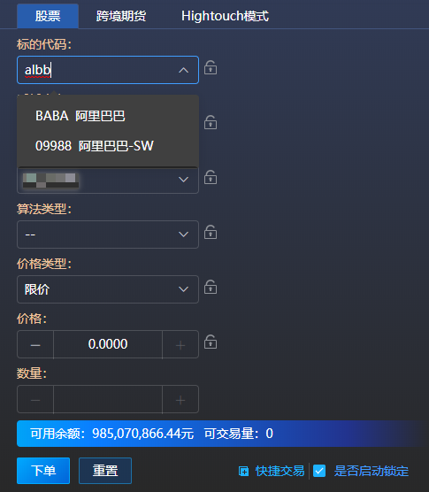

*   指令框支持全键盘操作，按键说明如下：

回车键，按回车键切换至下一输入要素、提交确认指令；

委托方向、价格类型字段支持按↑↓键展开下拉弹框；

*   指令框支持锁定操作（跨境期货、跨境期权交易菜单操作一致），勾选下方“是否启动锁定”选择，弹出按钮，点击按钮，下单成功后该指令框内容将锁定保存。再次点击按钮解锁后才能修改对应指令框内容；

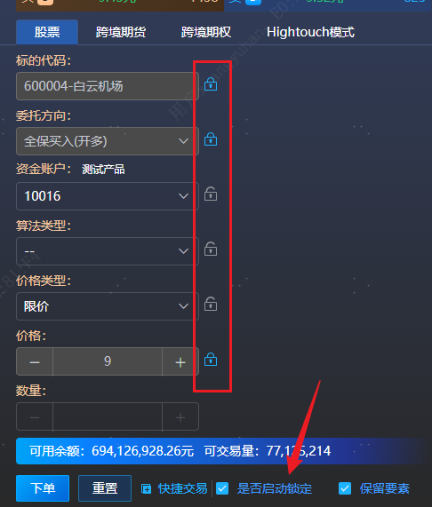

*   保留要素操作（跨境期货、跨境期权交易菜单操作一致），勾选下方“保留要素”选择，下单成功后将保留所有指令框内容；

*   针对股票标的，支持快捷委托比例，输入后按可交易量对应比例自动填写委托数量。可以根据需求在界面右上角用户名称旁设置按钮处设置是否展示快捷比例模块；

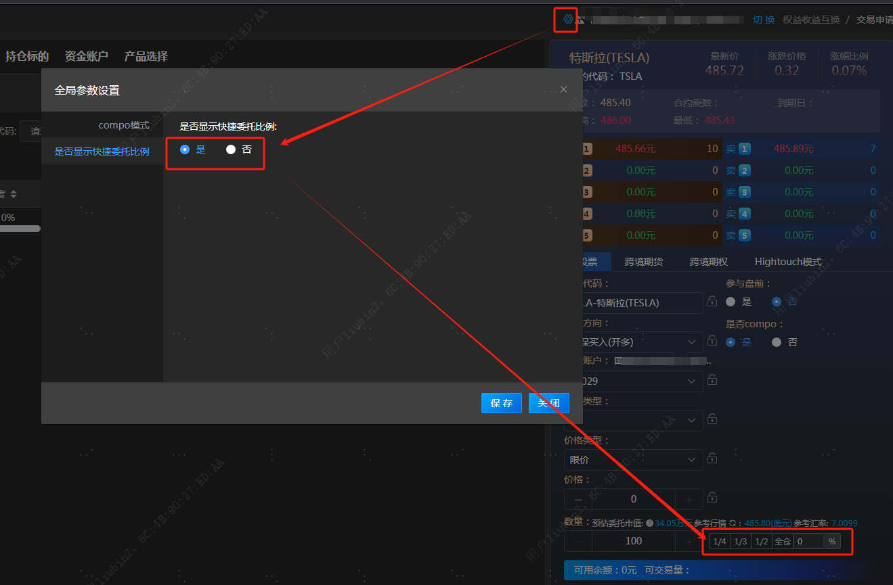

*   委托方向：包括：全保买入(开仓)、全保卖出(平仓)、融券卖出(开仓)、买入还券(平仓)，对应关系如下表：

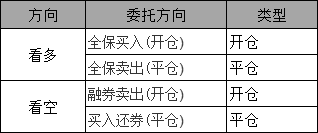

*   资金账户：默认展示当前登录账户，如管理人需要指定其他产品下单、或者多产品批量下单，可以选择字段产品或者选择多产品模式。
*   算法类型、价格类型：目前客户端支持的算法类型包括普通交易（--表示）、TWAP、VWAP、POV、Iceberg，价格类型包括市价、限价、开盘价、收盘价，两者对应关系如下表所示（注：普通交易不支持市价单）

**市场**

**算法**

**价格类型**

**必填项**

A股

普通交易

限价

限价价格、委托数量

普通交易

开盘价

委托数量

普通交易

收盘价

委托数量

港/美/日股

普通交易

限价

限价价格、委托数量

TWAP

限价

限价价格、委托数量

TWAP

市价

委托数量

VWAP

限价

限价价格、委托数量

VWAP

市价

委托数量

POV

限价

限价价格、委托数量、跟量比例

POV

市价

委托数量、跟量比例

Iceberg

限价

限价价格、委托数量、交易所最大挂单量

*   由于港股不同标的，交易单位不同，比如00700.HK 交易单位100股，00002.HK交易单位500股，界面委托数量右侧针对港股会提示最新的交易单位，仅提示不做限制。为避免委托废单，委托时按最新交易单位的整数倍来委托。

*   可交易量，对于开仓（委托方向：全保买入、融券卖出），输入标的代码、委托方向、资金账户、算法类型、价格后，在数量下面显示可交易量；对于平仓（委托方向：全保卖出、买入还券），在输入代码、委托方向、资金账户后，数量下面即显示可交易量。
*   算法开始时间、算法结束时间；

算法开始、结束时间请严格按此格式填写填写：HHMM；

算法时间按北京时间填写，如美股全天TWAP，则开始时间和结束时间分别填写2130、0400；

不填开始时间只填截止时间，默认为下单时间到截止时间；

开始时间和截止时间均不填，默认为下单时间到收盘；

不允许只填写开始时间，不填写截止时间；

请确保算法开始时间大于等于下单时间点北京时间，比如11:00下单，请确保算法开始时间大于等于11:00；

*   算法时间快速选择；

单产品委托和管理人委托界面中的境外股票、跨境期货交易支持算法时间期限选择，在开始时间上面设有5min、10min、30min、1H、2H按钮，点击选择后，默认以当前时间的下一分钟为开始时间，以所选按钮时间为算法时间期限，自动带出开始时间和结束时间。开始时间显示北京时间，输入框右上角显示交易所当地时间。该功能仅针对跨境交易，且算法选择 twap、vwap、pov时出现。若美股盘前非交易时间下单，则算法开始时间默认为开盘时间。举例:

若当前夏令时 20:51:25，纳斯达克交易所下单，选择 1H，开始时间自动填写 21:30，结束时间自动填写22:30。

若当前夏令时 22:13:43，纳斯达克交易所下单，选择 5min，开始时间自动填写 22:14，结束时间自动填写22:19。

*   POV算法Target Percent 支持1.00%-30.00%数值，支持填写小数点后两位，不支持填写小于1%的数值；
*   Iceberg算法Display Size数值必须小于等于委托数量；
*   交易指令仅当天有效，不支持隔日委托。

#### 多指令窗口

为方便多个标的交易，交易指令界面支持增加多个指令提交窗口，点击证券代码上方“**+**”即可增加新的指令委托窗口，新增的窗口委托指令要素同主界面指令委托一致，新增的窗口如需关闭，需要逐一点击每个窗口右上角“**X**”来关闭。整体界面如下图所示。

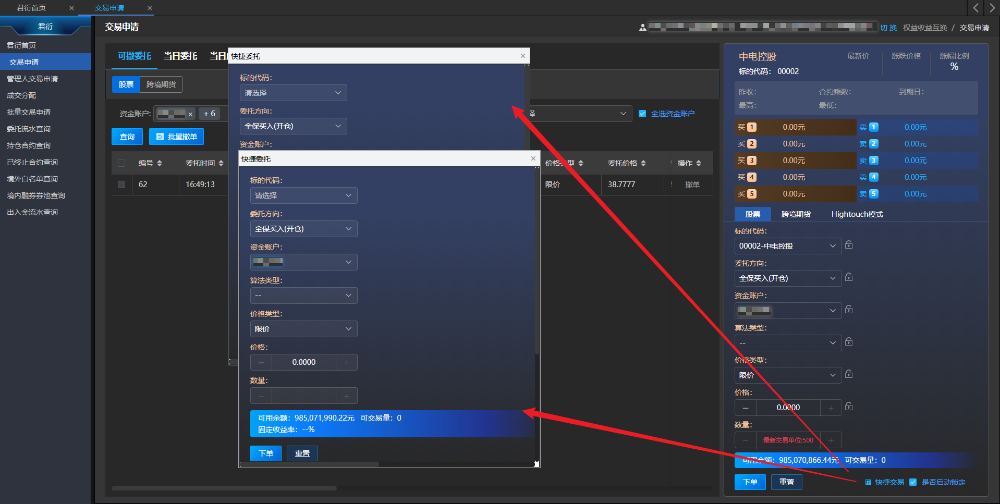

注意，新增的窗口会置于顶层，如新增窗口过多，可能会主界面查看，可以通过鼠标移动窗口，如电脑有两个显示屏，可以把新增窗口移到另外显示屏中，如下图。

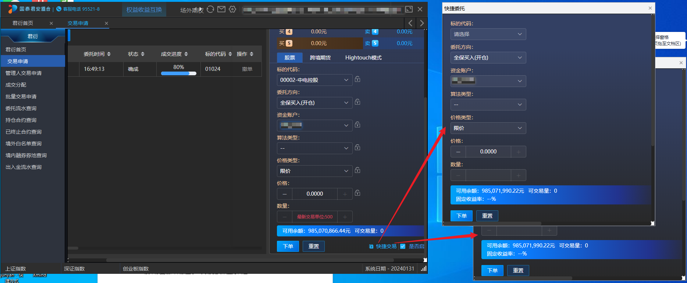

#### 多产品指令操作

针对多产品下单，“资金账户”选择多产品后，会打开产品选择界面，如下图所示，产品选择界面展示资金账户可用金额、可委托量、委托数量，其中可委托量默认显示为0，需要结合委托价格计算可委托量；

输入算法类型、价格后，系统自动根据价格计算出每个产品可委托量；

输入委托数量，产品选择界面可以选择数量分配策略，默认为每单元固定数，可以选择修改。每个选项说明如下：

*   每单元固定数：每个选中的资金账户均按输入数量显示，比如委托数量输入9000股，则此模式下每个账户的委托量均为9000股，如下图所示；

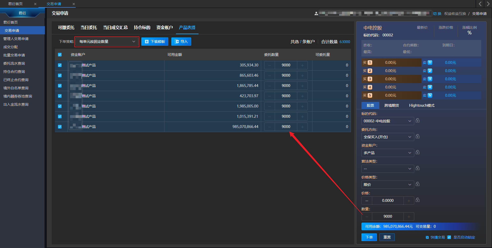

*   平均分配：根据选中的资金账户来均分委托数量，每个账户的委托数量向下取整，比如输入2000股，选中4个资金账户，此模式下每个账户委托量均为500股，如下图所示；

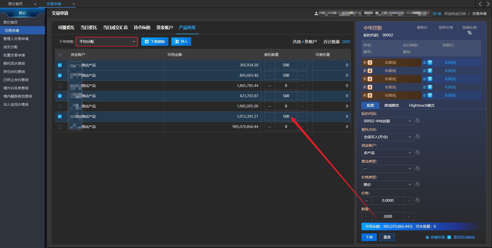

*   按可委托量比例：根据选中的资金账户可委托量占比\*委托数量来进行分配，每个账户的委托数量向下取整，比如输入1000股，选中2个资金账户，此模式下每个账户委托量如下图所示；

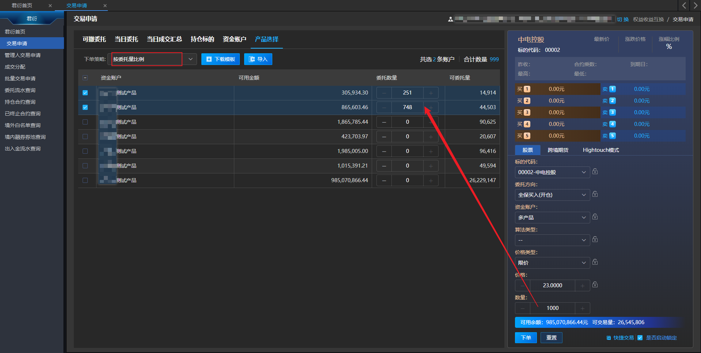

*   自定义输入：自由输入每个账户的委托数量，指令栏委托数量根据自定义输入的汇总展示，比如账户1-3分别输入100,200,300，则委托数量显示：600股，如下图所示

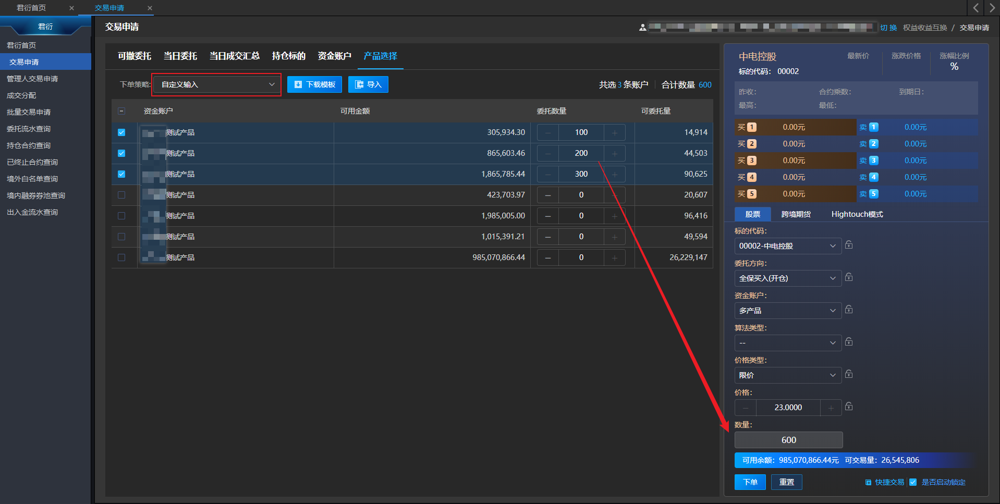

每个账户的委托数量输入完成后，点击下单按钮即可提交多产品指令。

产品选择界面新增导入功能，用于批量导入多个产品指令信息，导入界面如下图所示。同时为方便各个管理导入内部产品编码，支持按国泰海通账号导入，也支持按管理人内部账号导入，只需提前设置对应关系即可。

导入模板分为两个sheet页，sheet2定义客户账户与互换账户之间对应关系；sheet1填写导入的内容，其中：

（1）国泰海通客户账号、产品全称非必填，如填写，则按该账号送到系统；

（2）国泰海通账号未填写，只填写贵司账号，则按sheet2里对应关系取国泰海通账号；

（3）一个产品只能有一条记录导入，如导入包含重复的，则报错提示。

Sheet1

Sheet2

#### 行情展示

*   目前支持A股（ETF）、港股(ETF)五档行情展示，美股行情暂未展示，后续将逐步按美股市场开放行情展示。

#### 可撤委托

*   选中可撤委托界面中的股票tab，展示当日股票可撤单委托，支持单笔撤单和批量撤单；
*   该界面默认展示登录账户的当日可撤委托，如查询多个账户可通过资金账户条件多选来查询；
*   指令下单后，可在该菜单实时查看指令状态及实时成交情况，具体见字段：成交价格、成交数量。

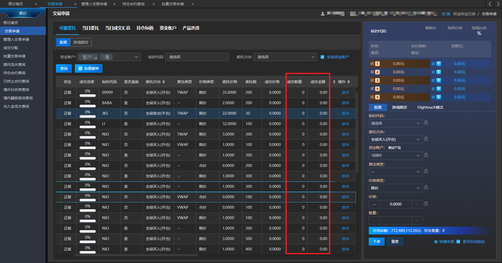

#### 当日委托

*   该界面默认展示登录账户当日单产品模式下单的全部委托，包括已成交和未成交的；

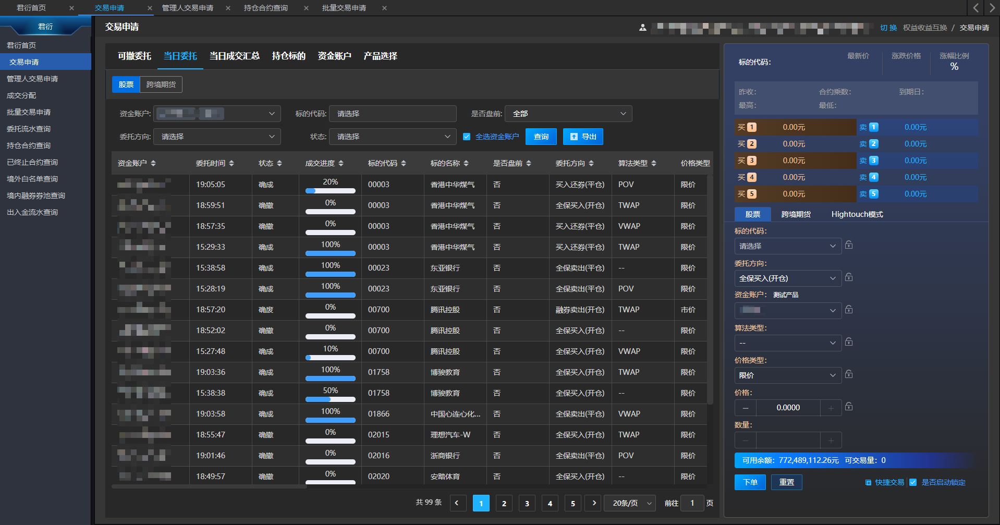

#### 当日成交汇总

*   该菜单按资金账户、标的代码、委托方向、是否compo汇总展示当日的成交情况，包括成交均价、成交数量、成交金额；
*   该界面默认展示登录账户当日单产品模式下单的成交汇总情况；

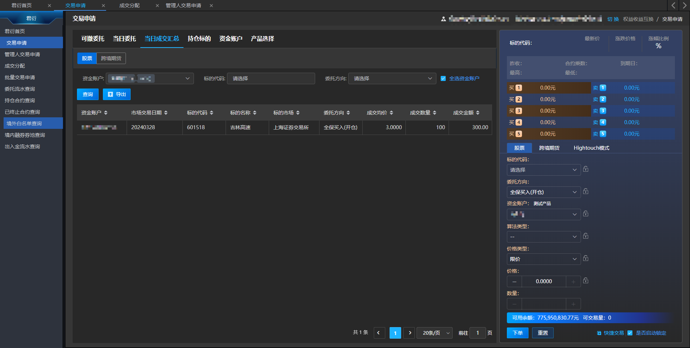

#### 交易全景

*   该菜单按资金账户、标的代码、委托方向、是否compo汇总展示当日单产品模式下单的总体委托情况，包括委托笔数、成交笔数、成交总数量、已撤单数量、累计未成交数量等；

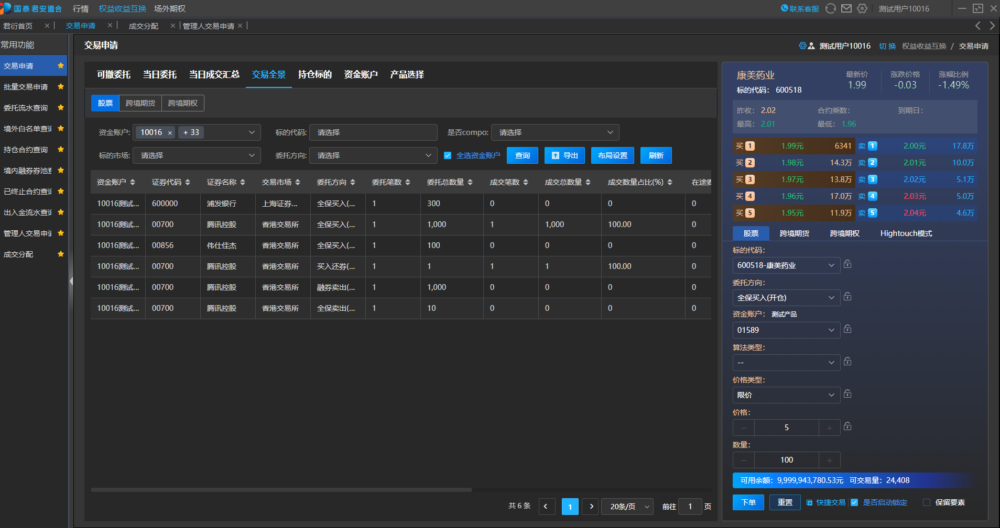

#### 持仓标的

*   该菜单按资金账户、标的代码、委托方向汇总展示客户当前持仓标的情况，包括持仓数量、存续名义本金（计价）、持仓成本价；

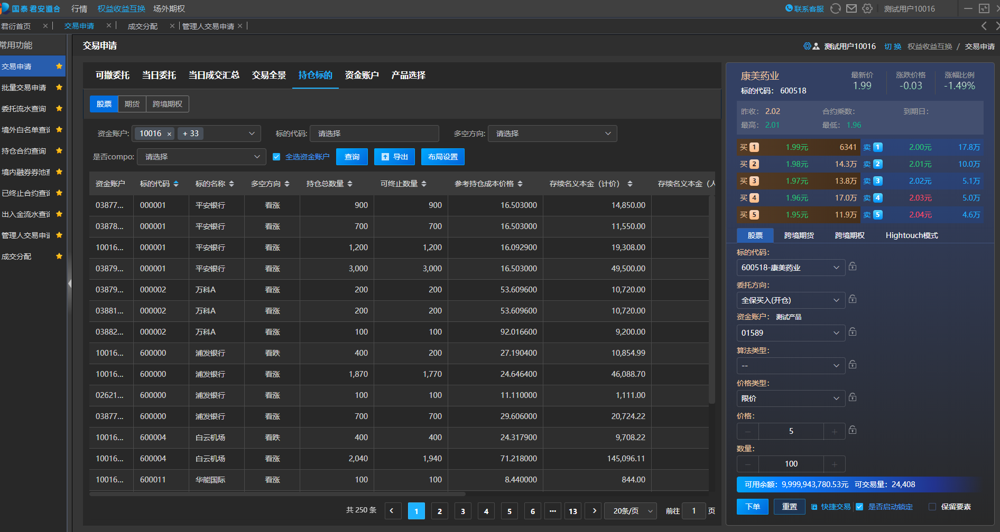

#### 资金账户

*   该菜单按资金账户展示客户当前盯市资金情况，包括履约保障价值余额及可用、可取金额。默认展示当前客户资金情况，可以点击查询查看其他产品；
*   买入、卖出会实时影响可用、可取资金。
*   可以通过成交分配界面资金账户旁边按钮设置资金账户排序。排序仅对当前页有效，可以在页面下方分页按钮处选择每页展示数据条数，查看全部产品户。
*   点击查询按钮可以刷新资金信息

### 跨境期货交易操作

在菜单界面和交易界面分别选中跨境期货tab，查询跨境期货相关委托信息并进行交易。

#### 指令输入

在交易界面点击跨境期货tab进行下单。跨境期货交易需要填写期货品种并选择合约年月，目前道合支持的跨境期货品种如下表所示，注意期货品种严格按照下表输入，比如恒生指数期货输入HSI（支持小写）：

名称

期货品种

市场

H股指数

HHI

香港联合交易所

恒生指数

HSI

恒生科技指数

HTI

M-恒生指数

MHI

标普500

ES

芝加哥商品交易所

微型标普500

MES

微型纳斯达克指数100

MNQ

纳斯达克指数100

NQ

日经225指数（美元）

NKD

迷你罗素2000

RTY

微型罗素2000

M2K

富时中国A50指数

CN

新加坡证券交易所

日经225指数（日元）

NK

其余操作与股票相同，选择算法类型、输入价格、委托手数等参数。

#### 可撤委托

在可撤委托菜单界面点击跨境期货tab查看当日可撤委托。通过勾选委托并点击“批量撤单”按钮可以进行批量撤单。点击委托详情后的“撤单”按钮可以撤单对应委托。

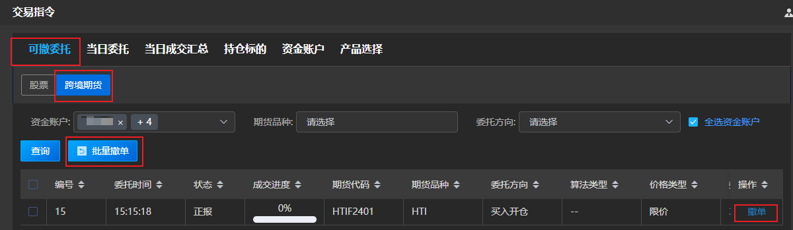

#### 合约终止

跨境期货有两种合约终止方式，界面输入和持仓页面点击；

*   界面输入：在交易界面输入待平仓期货品种和合约年月，选择持仓对应的委托方向，输入其余指令后下单进行平仓。

*   持仓页面点击：在持仓标的界面选择跨境期货tab，点击持仓记录左侧“平仓”按钮，交易界面会自动填写期货品种、合约年月、委托方向和资金账户的内容，输入其余指令后下单进行平仓。

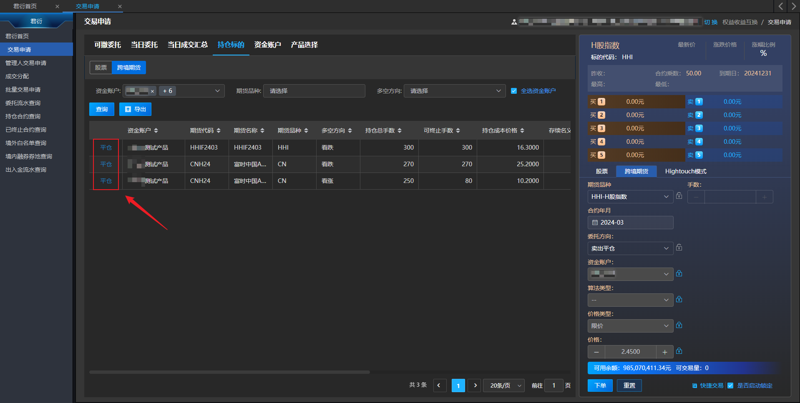

### Hightouch模式

在交易界面选中“Hightouch”tab，进行Hightouch交易。目前Hightouch仅针对股票进行交易，在Hightouch模式下，客户下单时将算法信息填写在“业务备注”中，下单后由后台人员根据客户备注信息人工下单。

#### 指令输入

在交易界面点击“Hightouch”tab进行下单。需要填写证券代码、资金账号、委托类型、委托价格（限价类型需要填写，市价类型不显示）、委托数量，业务备注（支持输入50个汉字），其余操作与股票相同。

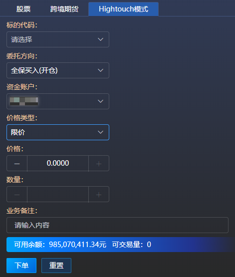

#### 交易模式查询

有两个界面可以查询到委托的交易模式，以及Hightouch模式填写的业务备注。

1、在当日委托菜单界面点击股票tab查看当日可撤委托，交易模式和业务备注详情在每条记录后面交易模式和业务备注两个字段展示。

1.  在委托流水查询界面点击股票tab查看账户委托流水，交易模式和业务备注详情在每条记录后面交易模式和业务备注两个字段展示。

### 跨境期权交易操作

#### **跨境期权开仓交易申请**

在菜单界面和交易界面分别选中跨境期权tab，查询跨境期权相关委托信息并进行交易。

目前仅支持：港交所、纽交所、纳斯达克三个市场的正股和ETF期权交易。界面要素如下图所示。

#### **平仓交易申请**

平仓申请有两种方式：

方式1：右侧交易面板输入需要平仓的期权信息，包括正股代码、期权方向、委托方向、到期日、行权价、委托价格、委托张数等；

方式2：通过点击交易申请菜单左侧“持仓标的”下的“跨境期权”界面的持仓列表的蓝色“平仓”文字，自动带入拟平仓期权的相关要素到交易面板，再输入委托价格和张数即可。

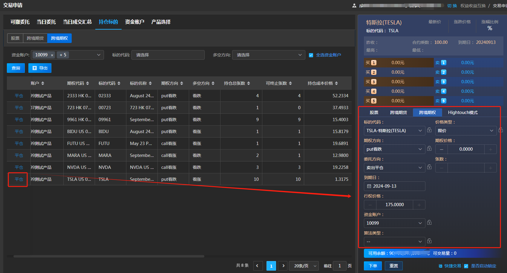

#### **撤单**

菜单路径：交易申请菜单，左侧“可撤委托”下面的“跨境期权”界面

撤单方式同股票交易撤单一致，支持单笔撤单，即点击右撤蓝色“撤单”文字撤单，也可以勾选框选中选中后，点击上面蓝色“批量撤单”按钮撤单

#### **委托查询**

委托流水查询有两种方式：

方式1：

菜单路径：交易申请菜单，左侧“当日委托”菜单下跨境期权界面

该界面显示了当日跨境期权的全部委托情况。

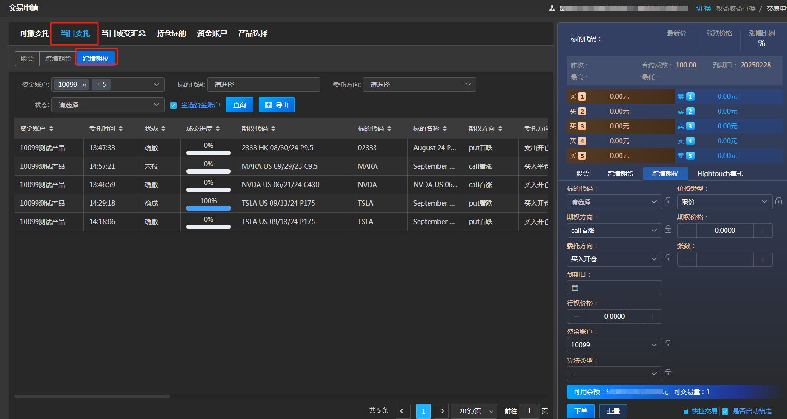

方式2：

菜单路径：委托流水查询菜单，点击“跨境期权”

该界面显示了通过君衍下单的，历史全部跨境期权的全部委托情况。

#### **成交查询**

菜单路径：交易申请菜单，左侧“当日成交汇总”查询下的“跨境期权”界面

该界面显示了当日跨境期权的全部成交情况。

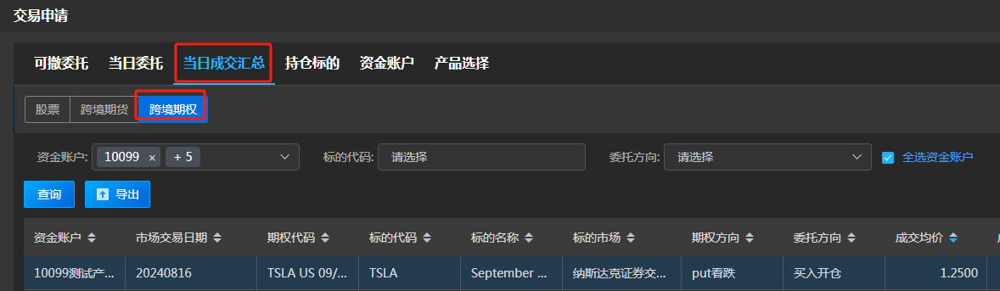

#### **持仓查询**

菜单路径：交易申请菜单，左侧“持仓标的”下的“跨境期权”界面

该界面显示了跨境期权的持仓情况。

### 美股盘前交易

股票和Hightouch界面支持美股盘前交易，目前仅限纽约证券交易所、纳斯达克证券交易所、美国证券交易所和Bats市场的标的。

#### 指令输入

在股票tab和“Hightouch ”tab输入纽约证券交易所、纳斯达克证券交易所、美国证券交易所或Bats市场的标的，弹出“参与盘前”选项，可以选择“是/否”。选“是”则参与盘前交易，选“否”则为盘中交易。

盘前交易时段为：

夏令时：16:00-美股开盘时间

冬令时：17:00-美股开盘时间

盘前委托会同时参加盘前和盘中交易。盘前交易仅支持限价，不支持算法单。

### Compo模式交易

股票和Hightouch界面支持跨境股票Compo模式交易，目前仅限香港证券交易所和纽约证券交易所、美国证券交易所、纳斯达克证券交易所、粉单市场、Bats市场的股票和ETF标的。

#### 指令输入

若产品已有Compo模式交易确认书，则在股票tab和“Hightouch ”tab输入支持使用Compo模式交易的标的后会弹出“是否compo”选项，可以选择“是/否”。选“是”则使用Compo模式交易，选“否”则使用普通模式交易。

Compo模式汇率取彭博BFIX16点汇率。

Compo模式支持的算法类型、价格类型与普通港股美股一致，算法类型包括普通交易（--表示）、TWAP、VWAP、POV、Iceberg，价格类型包括市价、限价、开盘价、收盘价（注：普通交易不支持市价单）

Compo模式交易时段与普通港股美股一致。

Compo模式支持单产品和多产品下单。

Compo模式可撤委托查询、当日委托查询、当然成交汇总查询、持仓标的查询等操作与普通港股美股一致，通过“是否compo”字段区分合约类型。

#### Compo模式设置

若不希望每次选择是否Compo，可以在界面右上角用户名称旁设置按钮处设置默认的Compo模式。

该参数仅针对跨境股票多头交易生效。1、如选择“是”,则针对跨境股票交易申请界面默认选择compo模式；2、如选择“否”,则针对跨境股票交易申请界面默认选择非compo模式，即Local模式；3、如选择“每笔界面选择”,则每笔跨境股票交易根据上一笔选项选择compo模式。

管理人交易申请
-------

菜单：【权益收益互换】-【管理人交易申请】

用于进行管理人维度的交易。目前管理人只支持股票交易。成交后需要在成交分配界面中将成交数量分配至管理人名下各个产品。

注：默认不支持管理人模式，如有相关需要请提前与对口客户经理联系。

### 股票交易操作

#### 指令输入

目前支持：**A股**（含ETF，包括上海证券交易所、深圳证券交易所）、**港股**(含ETF，包括香港联合交易所)、**美股**（含ETF，包括纽交所、纳斯达克证券交易所、美国证券交易所、粉单市场、Bats市场）、**日股**（含ETF，包括东京证券交易所）看多型开平仓和看空型开平仓。资金账户限定选择管理人，其余指令与股票交易操作相同。

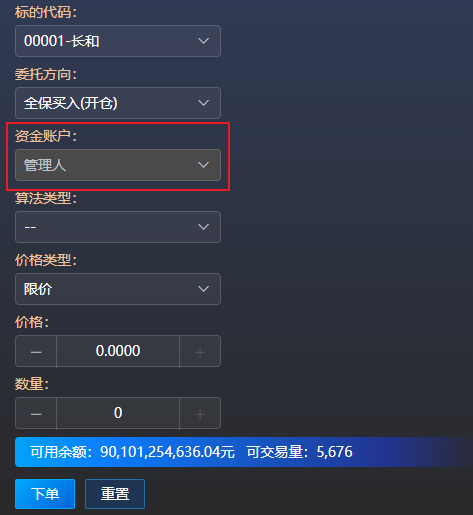

#### 可撤委托

*   选中可撤委托界面中的股票tab，展示当日股票可撤单委托，支持单笔撤单和批量撤单；
*   该界面展示以管理人进行交易的当日可撤委托；
*   指令下单后，可在该菜单实时查看指令状态及实时成交情况，具体见字段：成交价格、成交数量。

#### 当日委托

*   该界面展示管理人当日的全部委托，包括已成交和未成交的；

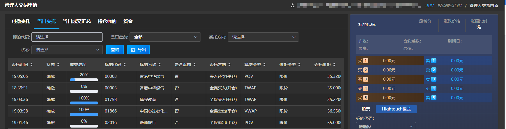

#### 当日成交汇总

*   该菜单按标的代码、委托方向、是否compo汇总展示当日成交情况，包括成交均价、成交数量、成交金额；
*   该界面默认展示管理人当日成交汇总；

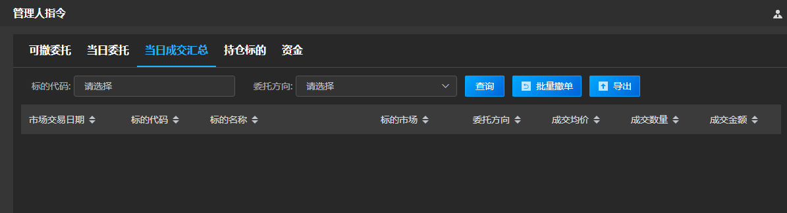

#### 交易全景

*   该菜单按标的代码、委托方向、是否compo汇总展示当日管理人总体的委托情况，包括委托笔数、成交笔数、成交总数量、已撤单数量、累计未成交数量等；

#### 持仓标的

*   该菜单上方表格按标的代码、多空方向汇总展示管理人当前持仓标的情况，包括持仓数量、可平仓数量；
*   双击上方表格记录，下方表格中显示管理人名下各产品持有该标的该方向的情况；

#### 资金

*   该菜单上方表格汇总展示管理人资金的情况，包括保证金总额（元）、可用保证金（元）、可开仓保证金（元）。下方表格显示管理人名下各个产品的资金情况；
*   可以通过成交分配界面资金账户旁边按钮设置资金账户排序。排序仅对当前页有效，可以在页面下方分页按钮处选择每页展示数据条数，查看全部产品户。
*   点击刷新按钮，可以更新对应部分的资金信息。

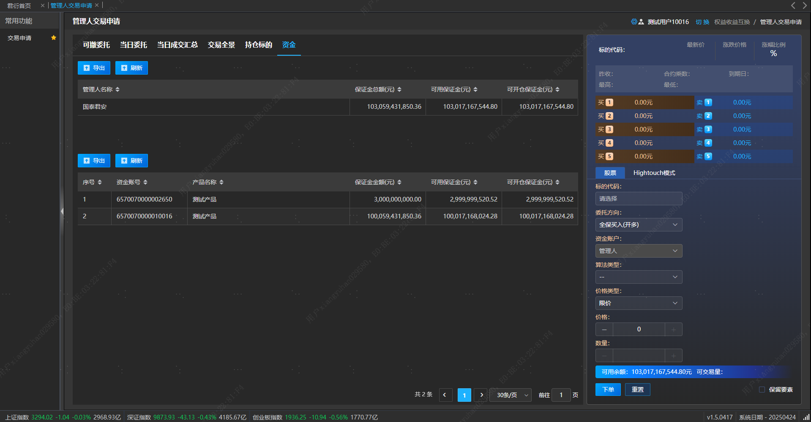

### Hightouch交易操作

在交易界面选中“Hightouch”tab，进行Hightouch交易。目前Hightouch仅针对股票进行交易，在Hightouch模式下，客户下单时将算法信息填写在“业务备注”中，下单后由后台人员根据客户备注信息人工下单。

#### 指令输入

在交易界面点击“Hightouch”tab进行下单。需要填写证券代码、资金账号、委托类型、委托价格（限价类型需要填写，市价类型不显示）、委托数量，业务备注（支持输入50个汉字），其余操作与股票相同。

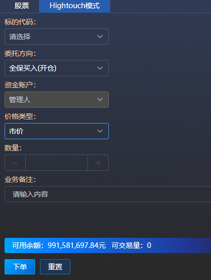

#### 交易模式查询

有两个界面可以查询到委托的交易模式，以及Hightouch模式填写的业务备注。

1、在当日委托菜单界面点击股票tab查看当日可撤委托，交易模式和业务备注详情在每条记录后面交易模式和业务备注两个字段展示。

2、成交分配后，在委托流水查询界面点击股票tab查看各账户委托流水，交易模式和业务备注详情在每条记录后面交易模式和业务备注两个字段展示。

### 美股盘前交易

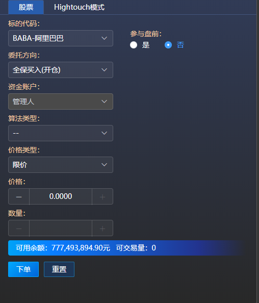

股票和Hightouch界面支持美股盘前交易，目前仅限纽约证券交易所、纳斯达克证券交易所、美国证券交易所和Bats市场的标的。

#### 指令输入

在股票tab和“Hightouch ”tab输入纽约证券交易所、纳斯达克证券交易所、美国证券交易所或Bats市场的标的，弹出“参与盘前”选项，可以选择“是/否”。选“是”则参与盘前交易，选“否”则为盘中交易。

盘前交易时段为：

夏令时：16:00-美股开盘时间

冬令时：17:00-美股开盘时间

盘前委托会同时参加盘前和盘中交易。盘前交易仅支持限价，不支持算法单。

### Compo模式交易

股票和Hightouch界面支持跨境股票Compo模式交易，目前仅限香港证券交易所和纽约证券交易所、美国证券交易所、纳斯达克证券交易所、粉单市场、Bats市场的股票和ETF标的。

#### 指令输入

若主产品已有Compo模式交易确认书，则在股票tab和“Hightouch ”tab输入支持使用Compo模式交易的标的后会弹出“是否compo”选项，可以选择“是/否”。选“是”则使用Compo模式交易，选“否”则使用普通模式交易。

Compo模式汇率取彭博BFIX16点汇率。

Compo模式支持的算法类型、价格类型与普通港股美股一致，算法类型包括普通交易（--表示）、TWAP、VWAP、POV、Iceberg，价格类型包括市价、限价、开盘价、收盘价（注：普通交易不支持市价单）

Compo模式交易时段与普通港股美股一致。

Compo模式可撤委托查询、当日委托查询、当然成交汇总查询、持仓标的查询等操作与普通港股美股一致，通过“是否compo”字段区分合约类型。

#### Compo模式设置

若不希望每次选择是否Compo，可以在界面右上角用户名称旁设置按钮处设置默认的Compo模式。

该参数仅针对跨境股票多头交易生效。1、如选择“是”,则针对跨境股票交易申请界面默认选择compo模式；2、如选择“否”,则针对跨境股票交易申请界面默认选择非compo模式，即Local模式；3、如选择“每笔界面选择”,则每笔跨境股票交易根据上一笔选项选择compo模式。

成交分配
----

菜单：【权益收益互换】-【成交分配】

用于对管理人成交的订单进行分配。

### 成交分配

选择成交分配tab，打开成交分配界面，本界面主要分为三个区域：

*   左侧上方查询区域：默认展示管理人待分配委托，包括标的代码、委托方向、成交价格、成交数量等信息。
*   左侧下方查询区域：展示当前登录客户该标的该方向的持仓情况。
*   右侧操作区域：进行成交分配。

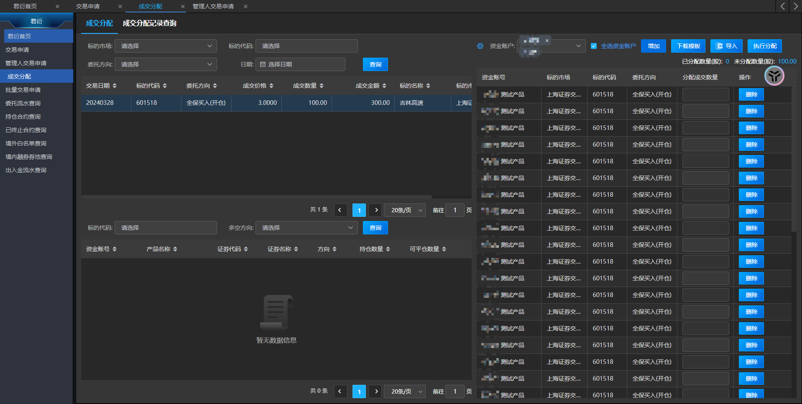

**操作说明：**

*   在左侧表格选择待分配记录，在资金账户下拉菜单中选择需要分配的产品并点击“增加”按钮，产品信息显示在右侧表格中。输入各产品对应的分配成交数量，点击“执行分配”按钮进行分配。也可以通过导入的方式进行分配；
*   各产品分配数量之和需与管理人委托汇总成交数量一致。
*   输入分配成交数量时，支持使用↑、↓键切换到上一个输入框或下一个输入框，也支持Enter回车键切换下一条记录。

*   点击资金账户旁边设置按钮可以设置资金账户排序。将左侧原列表产品按所需顺序添加到排序后列表中，必须对全部产品进行排序，点击确定后保存排序设定。若需重新排序，点击重置即可恢复初始设置。此排序将同时应用到“交易申请->资金账户tab”、“管理人交易申请->资金账户tab”和“成交分配的产品分配列表”。

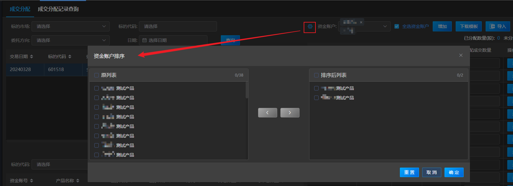

*   点击右上角以后每次旁边设置按钮可以设置成交分配默认比例，各产品比例之和需等于100%。设置后可以点击右侧“按比例分配”按钮进行分配，默认根据设置比例四舍五入取整分配，若产品设置比例为0则不显示。现有“增加”按钮功能不变。

### 成交分配记录查询

该菜单默认展示所有成交分配记录，包括资金账号、产品名称、买卖方向、标的代码、证券市场、成交价格、分配成交数量、成交金额、分配日期、是否compo等信息。支持导出和条件筛选查询。

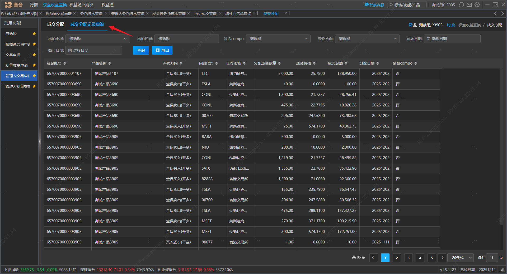

权益通交易申请
-------

菜单：【权益通】-【权益通交易申请】

权益通模式旨在打通互换期权业务，收益互换+场外期权D1结构合并下单，成交后再分配到对应的期权系统产品或者互换系统产品上。下单时汇总两边系统的可用资金、持仓数量进行总数控制，下单成交后，具体分配时，也会再验证每个待分配的产品是否满足。

注：默认不支持权益通模式，如有相关需要请提前与对口客户经理联系。

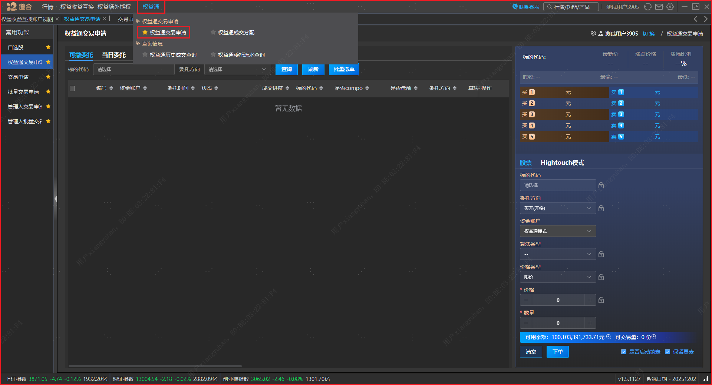

### 股票交易操作

#### 指令输入

目前仅跨境市场看多型开平仓和看空型开平仓，A股暂不支持，且看空型只能下互换单。指令输入方式与单产品交易一致

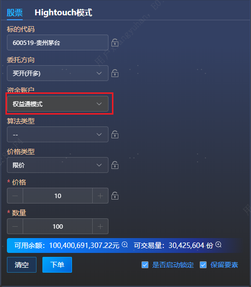

#### 可撤委托

*   选中可撤委托界面，展示当日可撤单委托，支持单笔撤单和批量撤单；
*   该界面展示以管理人进行交易的当日可撤委托；
*   指令下单后，可在该菜单实时查看指令状态及实时成交情况，具体见字段：成交价格、成交数量。

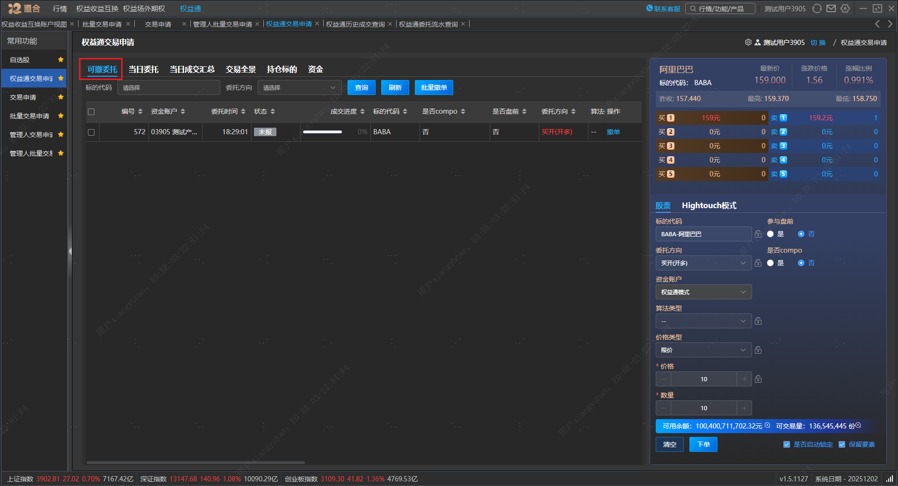

#### 当日委托

*   该界面展示权益通当日的全部委托，包括已成交和未成交的；

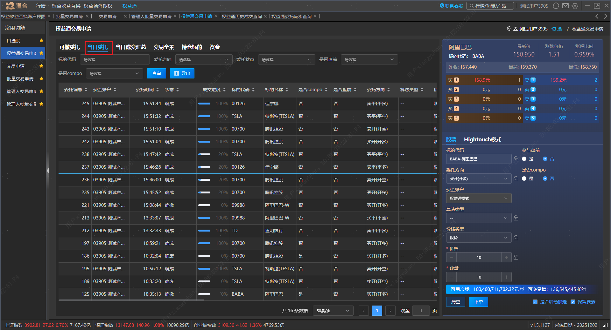

#### 当日成交汇总

*   该菜单按标的代码、委托方向、是否compo汇总展示当日成交情况，包括成交均价、成交数量、成交金额；

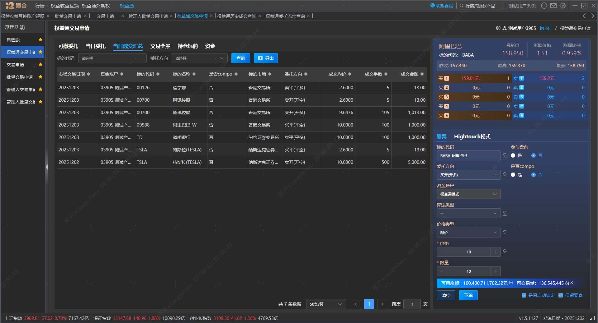

#### 交易全景

*   该菜单按标的代码、委托方向、是否compo汇总展示当日权益通总体的委托情况，包括委托笔数、成交笔数、成交总数量、已撤单数量、累计未成交数量等；

#### 持仓标的

*   该菜单上方表格按标的代码、多空方向汇总展示互换、期权账户当前持仓标的情况；
*   双击上方表格记录，下方表格中显示各产品持有该标的情况；

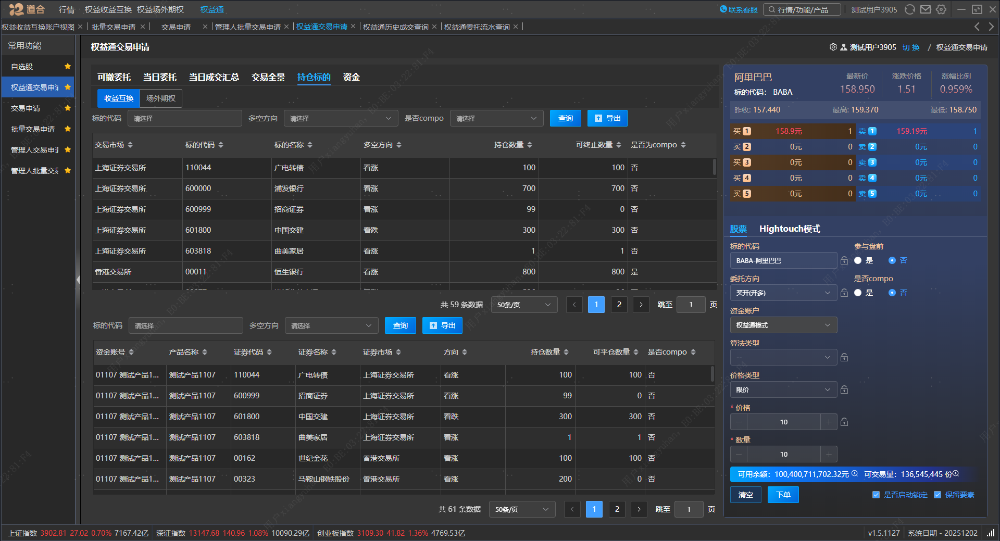

#### 资金

*   该菜单上方表格汇总展示互换账户和期权账户的资金情况，包括保证金总额（元）、可用保证金（元）、可开仓保证金（元）。下方表格显示各个产品的资金情况；
*   可以通过权益通成交分配界面资金账户旁边按钮设置资金账户排序。
*   点击刷新按钮，可以更新对应部分的资金信息。

### Hightouch交易操作

在交易界面选中“Hightouch”tab，进行Hightouch交易。目前Hightouch仅针对股票进行交易，在Hightouch模式下，客户下单时将算法信息填写在“业务备注”中，下单后由后台人员根据客户备注信息人工下单。

#### 指令输入

在交易界面点击“Hightouch”tab进行下单。需要填写证券代码、资金账号、委托类型、委托价格（限价类型需要填写，市价类型不显示）、委托数量，业务备注（支持输入50个汉字），其余操作与股票相同。

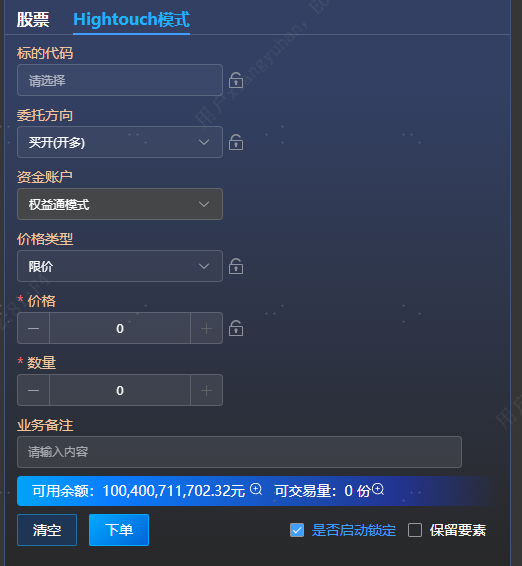

### 美股盘前交易

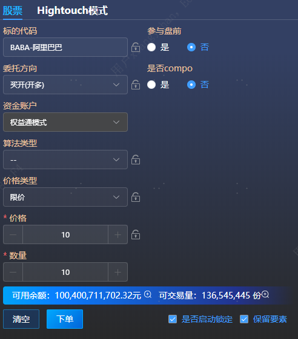

股票和Hightouch界面支持美股盘前交易，目前仅限纽约证券交易所、纳斯达克证券交易所、美国证券交易所和Bats市场的标的。

#### 指令输入

在股票tab和“Hightouch ”tab输入纽约证券交易所、纳斯达克证券交易所、美国证券交易所或Bats市场的标的，弹出“参与盘前”选项，可以选择“是/否”。选“是”则参与盘前交易，选“否”则为盘中交易。

盘前交易时段为：

夏令时：16:00-美股开盘时间

冬令时：17:00-美股开盘时间

盘前委托会同时参加盘前和盘中交易。盘前交易仅支持限价，不支持算法单。

### Compo模式交易

股票和Hightouch界面支持跨境股票Compo模式交易，目前仅限香港证券交易所和纽约证券交易所、美国证券交易所、纳斯达克证券交易所、粉单市场、Bats市场的股票和ETF标的。

#### 指令输入

若主产品已有Compo模式交易确认书，则在股票tab和“Hightouch ”tab输入支持使用Compo模式交易的标的后会弹出“是否compo”选项，可以选择“是/否”。选“是”则使用Compo模式交易，选“否”则使用普通模式交易。

Compo模式汇率取彭博BFIX16点汇率。

Compo模式支持的算法类型、价格类型与普通港股美股一致，算法类型包括普通交易（--表示）、TWAP、VWAP、POV、Iceberg，价格类型包括市价、限价、开盘价、收盘价（注：普通交易不支持市价单）

Compo模式交易时段与普通港股美股一致。

Compo模式可撤委托查询、当日委托查询、当然成交汇总查询、持仓标的查询等操作与普通港股美股一致，通过“是否compo”字段区分合约类型。

#### Compo模式设置

若不希望每次选择是否Compo，可以在界面右上角用户名称旁设置按钮处设置默认的Compo模式。

该参数仅针对跨境股票多头交易生效。1、如选择“是”,则针对跨境股票交易申请界面默认选择compo模式；2、如选择“否”,则针对跨境股票交易申请界面默认选择非compo模式，即Local模式；3、如选择“每笔界面选择”,则每笔跨境股票交易根据上一笔选项选择compo模式。

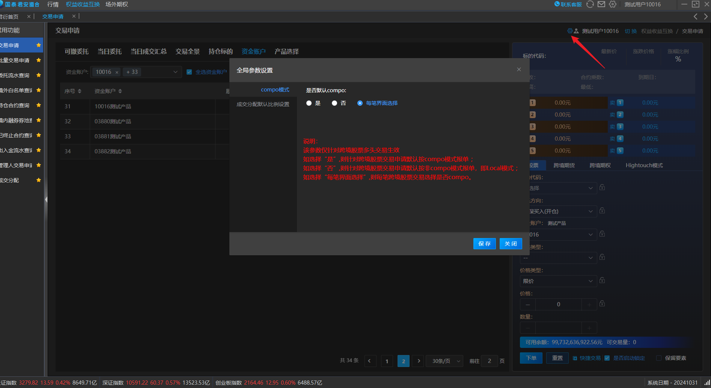

权益通成交分配
-------

菜单：【权益通】-【权益通成交分配】

用于对权益通成交的订单进行分配。

### 成交分配

选择成交分配tab，打开成交分配界面，本界面主要分为三个区域：

*   左侧上方查询区域：默认展示权益通待分配委托，包括标的代码、委托方向、成交价格、成交数量等信息。
*   左侧下方查询区域：展示当前各产品该标的持仓情况。
*   右侧操作区域：进行成交分配。

**操作说明：**

*   在左侧表格选择待分配记录，在资金账户下拉菜单中选择需要分配的产品并点击“增加”按钮，产品信息显示在右侧表格中。输入各产品对应的分配成交数量，点击“执行分配”按钮进行分配。也可以通过导入的方式进行分配；
*   各产品分配数量之和需与管理人委托汇总成交数量一致。
*   输入分配成交数量时，支持使用↑、↓键切换到上一个输入框或下一个输入框，也支持Enter回车键切换下一条记录。
*   对于需要分配给期权系统，需要在次日12点前进行分配，过了12点，无法分配给期权；
*   对于期权交易，需要有对应标的报价信息，客户才能用期权系统资金，并开仓分配给期权。
*   看空型不支持分配给期权账户。

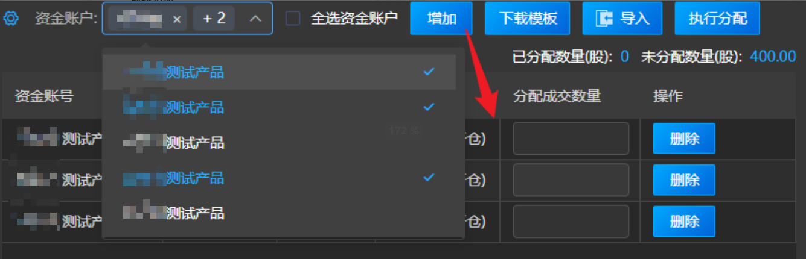

*   点击资金账户旁边设置按钮可以设置资金账户排序。将左侧原列表产品按所需顺序添加到排序后列表中，必须对全部产品进行排序，点击确定后保存排序设定。若需重新排序，点击重置即可恢复初始设置。此排序将同时应用到“权益通交易申请->资金账户tab”和“权益通成交分配的产品分配列表”。

*   点击右上角以后每次旁边设置按钮可以设置成交分配默认比例，各产品比例之和需等于100%。设置后可以点击右侧“按比例分配”按钮进行分配，默认根据设置比例四舍五入取整分配，若产品设置比例为0则不显示。现有“增加”按钮功能不变。

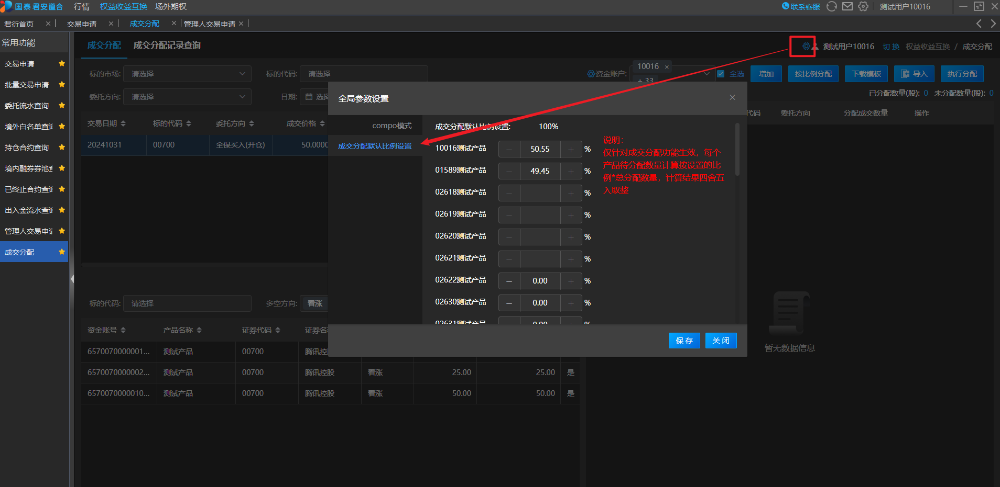

### 成交分配记录查询

该菜单默认展示所有成交分配记录，包括资金账号、产品名称、买卖方向、标的代码、证券市场、成交价格、分配成交数量、成交金额、分配日期、是否compo等信息。支持导出和条件筛选查询。

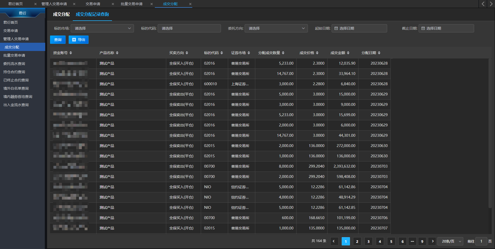

批量交易申请
------

单击菜单索引中【权益收益互换】-【批量交易申请】/【管理人批量交易申请】模块，将打开批量交易申请界面，支持批量导入委托和委托撤单。

【批量交易申请】为单产品模式，支持股票、跨境期货、跨境期权批量申请，点击tab进入对应界面。

【管理人批量交易申请】为管理人模式，仅支持股票批量申请。

### 股票批量申请

**批量导入（新）tab操作步骤：**

*   点击“批量导入（新）”tab

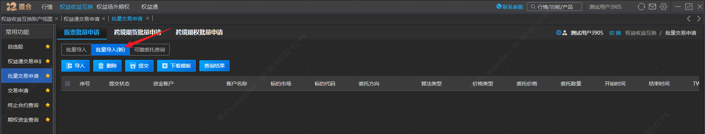

*   “下载模板”按钮，下载Excel模板文件到本地；
*   按指定规范在Excel中填写相关指令；
*   点击导入，选择填写好的模板，客户端会载入模板数据；载入数据后，可以查看导入的数据，界面支持数据修改；

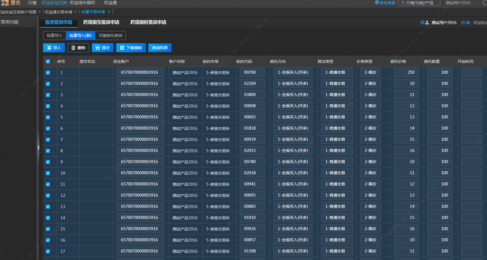

*   支持勾选后点击“删除”按钮，删除不需要的记录；
*   勾选需要导入的数据，支持批量勾选，点击“提交”完成指令委托；
*   注：请勿重复点击“提交”按钮造成指令重复发送。

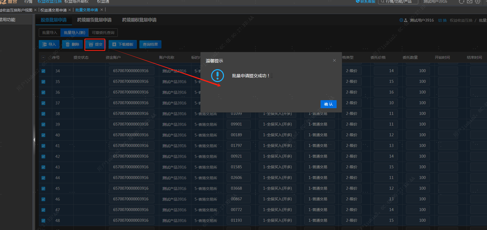

*   提交后，点击“查询结果”按钮，可以通过“提交状态”列查看指令是否提交成功，以及提交失败报错明细。

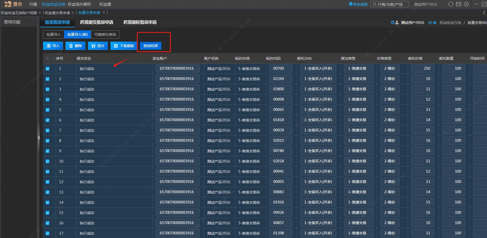

**可撤委托查询：**

批量指令提交后，如要撤单，可以在该菜单的可撤委托界面进行撤单操作。

*   该界面展示当天当日可撤单委托，支持单笔撤单和批量撤单；
*   该界面默认展示登录账户的当日可撤委托，如查询多个账户可以通过资金账户条件多选来查询；

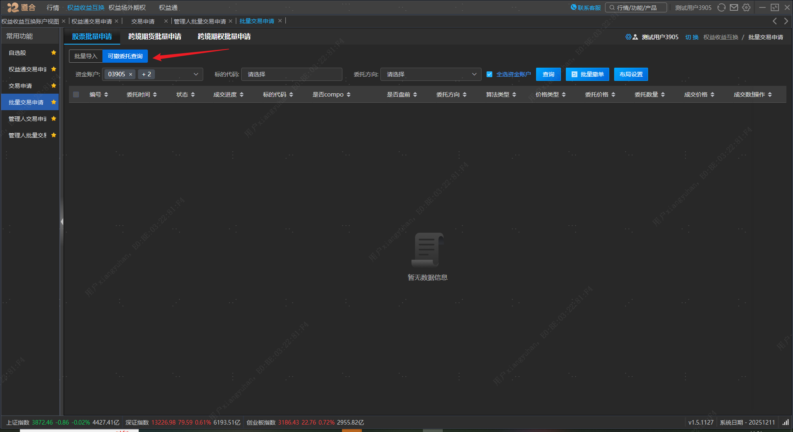

Excel模板填写规范如下:

*   输入前请将所有单元格格式设置为文本格式
*   标的市场请严格按此填写：1-上海证券交易所；2-深圳证券交易所；5-香港交易所；a-纽约证券交易所；b-美国证券交易所；c-纳斯达克证券交易所；r-BATS Exchange

备注：港股需要填写5位长度证券代码，比如腾讯输入00700。

*   委托方向请严格按此填写：1-全保买入(开仓)；2-全保卖出(平仓)；3-融券卖出(开仓)；4-买入还券(平仓)
*   算法类型请严格按此填写：1-普通交易；2-TWAP；3-VWAP；4-Iceberg；5-POV
*   价格类型请严格按此填写：1-市价；2-限价；3-开盘价；4-收盘价

备注：市价仅限境外市场TWAP、VWAP、POV；开盘价、收盘价仅限境内市场，对应算法类型为1-普通交易。

*   算法时间填写要求

算法开始、结束时间请严格按此格式填写填写：HHMM；

算法时间按北京时间填写，如美股全天TWAP，则开始时间和结束时间分别填写2130、0400；

不填开始时间只填截止时间，默认为下单时间到截止时间；

开始时间和截止时间均不填，默认为下单时间到收盘；

不允许只填写开始时间，不填写截止时间；

请确保算法开始时间大于等于下单时间点北京时间，比如11:00下单，请确保算法开始时间大于等于11:00；

*   是否compo合约请严格按此填写：0-否；1-是

备注：如不填写，则默认按0-否，即非compo合约报单

*   其他规则说明

POV算法Target Percent 数值区间为0.01%-30.00%；

Iceberg算法价格类型仅限限价。

### 期货批量交易

期货批量交易操作步骤与股票批量交易相同，同样支持批量导入和撤单。

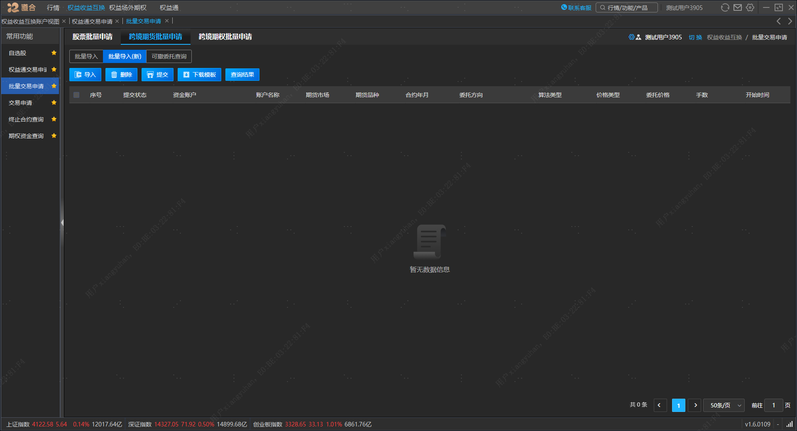

Excel模板填写规范如下:

填写说明：

*   输入前请将所有单元格格式设置为文本格式
*   标的市场请严格按此填写：1-上海证券交易所；2-深圳证券交易所；5-香港交易所；7-中国金融期货交易所；a-纽约证券交易所；b-美国证券交易所；c-纳斯达克证券交易所；d-伦敦证券交易所；e-新加坡证券交易所；w-芝加哥商品交易所；

备注：港股需要填写5位长度代码，比如腾讯填写00700

*   合约年月请严格按此格式填写：YYYY-MM
*   委托方向请严格按此填写：2B-买入开仓；2S-卖出平仓；3S-卖出开仓；3B-买入平仓；
*   算法类型请严格按此填写：1-普通交易；2-TWAP；3-VWAP；4-Iceberg；5-POV
*   价格类型请严格按此填写：1-市价；2-限价；3-开盘价；4-收盘价；

备注：

(1)市价仅限境外市场TWAP/VWAP/POV

(2)开盘价、收盘价仅限境内市场，对应算法类型1-普通交易

*   算法时间

算法开始、结束时间请严格按此格式填写填写：HHMM；

算法时间按北京时间填写，如美股全天TWAP，则开始时间和结束时间分别填写2130、0400；

不填开始时间只填截止时间，默认为下单时间到截止时间；

开始时间和截止时间均不填，默认为下单时间到收盘；

不允许只填写开始时间，不填写截止时间；

请确保算法开始时间大于等于下单时间点北京时间，比如11:00下单，请确保算法开始时间大于等于11:00；

*   其他规则说明

POV算法Target Percent 数值范围为0.01%-50%；

Iceberg算法价格类型仅限限价；

### **期权批量交易**

期权批量交易操作步骤与股票批量交易相同，同样支持批量导入和撤单。

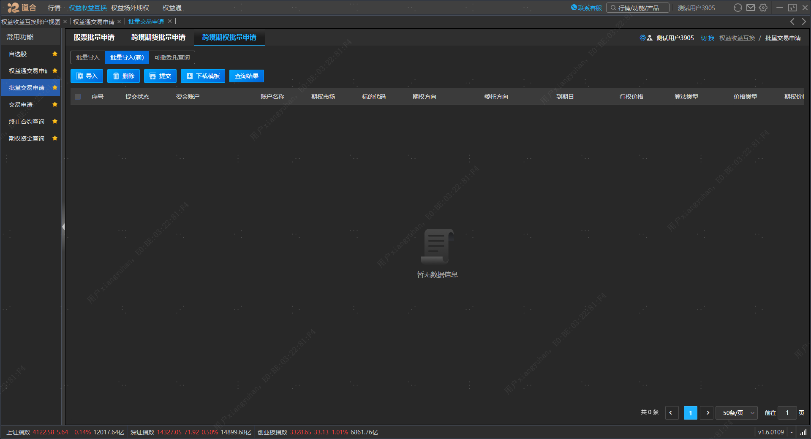

导入模板对应填写规范如下：

*   输入前请将所有单元格格式设置为文本格式
*   标的市场请严格按此填写：5-香港交易所；a-纽约证券交易所；b-美国证券交易所；c-纳斯达克证券交易所；

备注：港股需要填写5位长度代码，比如腾讯填写00700

*   到期日严格按此格式填写：YYYY-MM-DD；
*   委托方向请严格按此填写：2B-买入开仓；2S-卖出平仓；3S-卖出开仓；3B-买入平仓；
*   算法类型请严格按此填写：1-普通交易；
*   价格类型请严格按此填写：2-限价；
*   期权方向请严格按此填写：1-call看涨；0-put看跌；

收益互换出金申请
--------

单击菜单索引中【权益收益互换】-【收益互换出金申请】模块，将打开出金申请界面。

支持单笔出金、批量出金、单笔资金划转、批量资金划转。

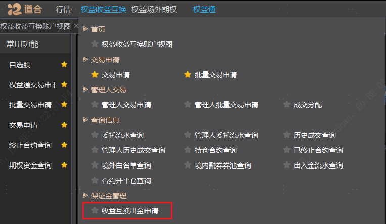

### 单笔出金

在菜单界面选中出金tab，可以发起出金申请。

**操作步骤：**

*   选择需要出金的资金账户；
*   输入提取金额并提交申请。根据出金金额大小，分为大额出金和小额出金流程。关于大额阈值，会结合流动性考虑动态调整。大额出金和小额出金操作略有区别，具体如下：
    *   小额出金：输入金额后直接点击“申请出金”按钮提交申请，无需上传附件；
    *   大额出金：

1.  输入提取金额；
2.  点击“下载履约担保品提取通知书”按钮下载履约担保品提取通知书并核对文件内容；

1.  点击“申请出金”按钮并上传履约担保品提取通知书，注意需上传用印件；

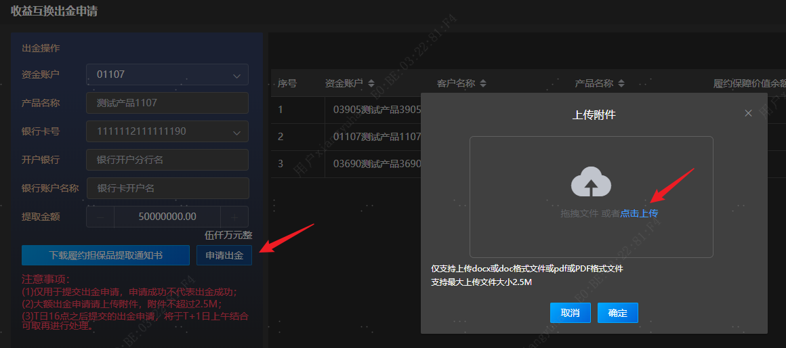

1.  确认出金信息并提交出金申请；

*   提交后，可以通过下方“出金申请记录查询”列表查看出金申请状态。

**注意事项：**

*   本界面仅用于提交出金申请，申请成功不代表出金成功；
*   大额出金申请请上传附件，附件不超过2.5M；
*   T日16点之后提交的出金申请，将于T+1日上午结合可取再进行处理；
*   大额出金需要二次复核，如需紧急出金可联系项目经理。

### 批量出金

在菜单界面选中批量出金tab，可以发起出金申请。

**操作步骤：**

*   支持两种金额填写方式：
    *   界面勾选：勾选资金账户并点击“增加”按钮，将选中账户展示在界面，在界面填写各账户出金金额。

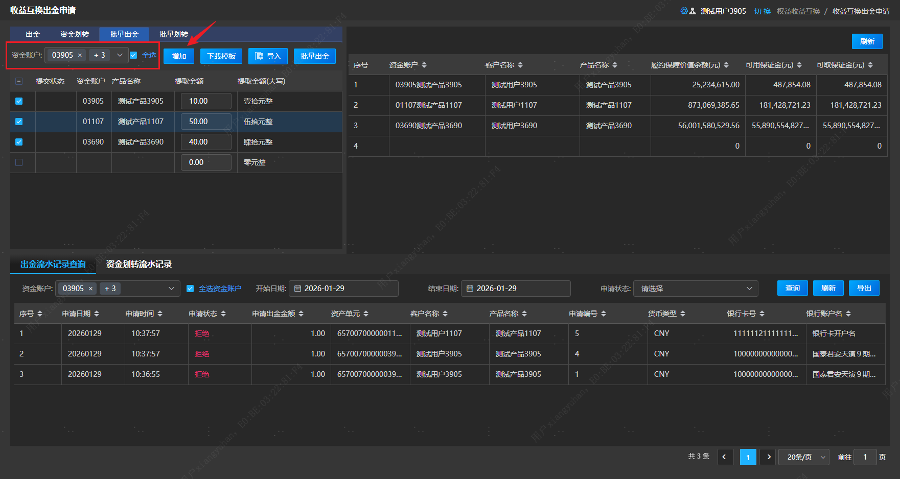

*   *   批量导入：通过导入模板批量导入需要出金的账户和对应金额。

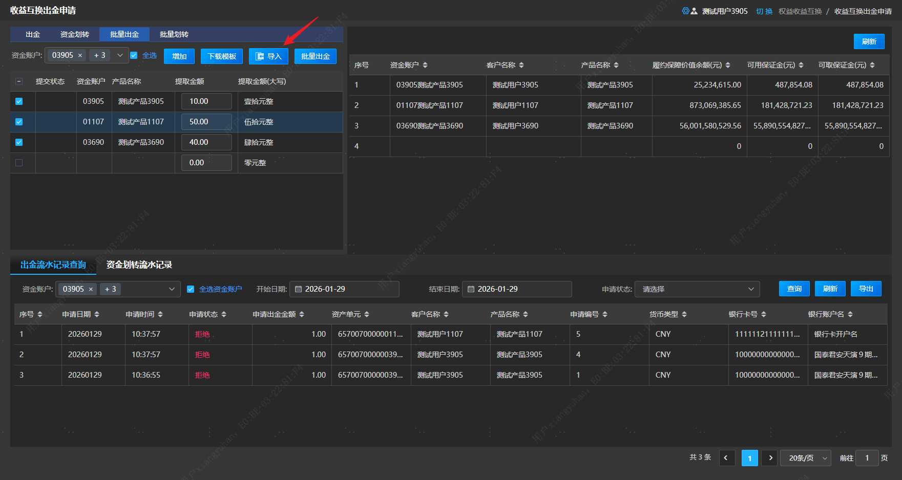

*   勾选出金记录并点击“批量出金”按钮提交申请。根据出金金额大小，分为大额出金和小额出金流程。关于大额阈值，会结合流动性考虑动态调整。大额出金和小额出金操作略有区别，具体如下：
    *   小额出金：若批量出金中没有大额出金，则无需上传附件直接提交申请；
    *   大额出金：若批量出金中有大额出金，则点击“批量出金”按钮后需上传附件。多笔出金将共用附件；
*   提交后，可以通过下方“出金申请记录查询”列表查看出金申请状态。

**注意事项：**

*   本界面仅用于提交出金申请，申请成功不代表出金成功；
*   大额出金申请请上传附件，附件不超过2.5M；
*   T日16点之后提交的出金申请，将于T+1日上午结合可取再进行处理；
*   大额出金需要二次复核，如需紧急出金可联系项目经理。

### 单笔资金划转

在菜单界面选中资金划转tab，可以发起资金划转申请。

**操作步骤：**

*   选择需要划转金的资金账户；
*   输入划转金额，点击“申请划转”按钮发起申请；

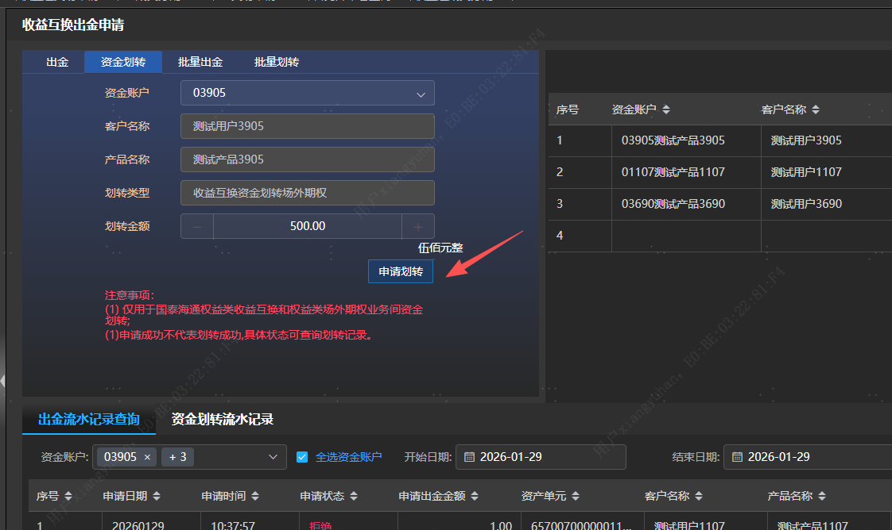

*   确认划转信息并提交划转申请；

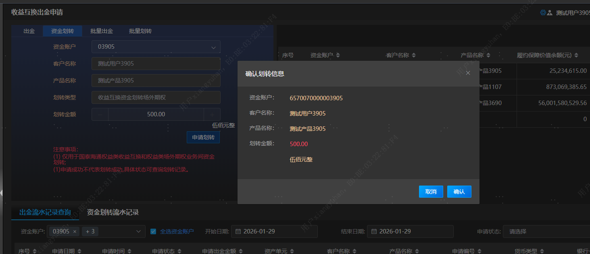

*   提交后，可以通过下方“资金划转流水记录”列表查看划转申请状态。

**注意事项：**

*   本界面仅用于国泰海通权益类收益互换和权益类场外期权业务间资金划转；
*   申请成功不代表划转成功，具体状态可查询划转记录。

### 批量划转

在菜单界面选中批量划转tab，可以发起出金划转。

**操作步骤：**

*   支持两种金额填写方式：
    *   界面勾选：勾选资金账户并点击“增加”按钮，将选中账户展示在界面，在界面填写各账户划转金额。

*   *   批量导入：通过导入模板批量导入需要划转的账户和对应金额。

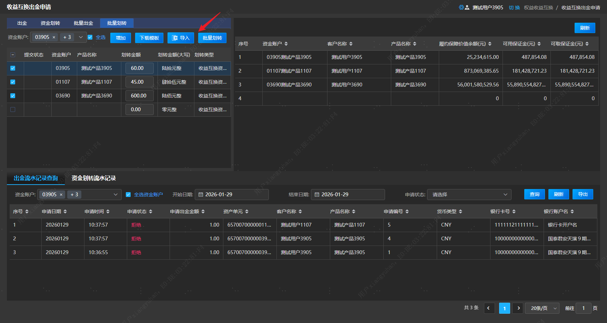

*   *   勾选划转记录并点击“批量划转”按钮提交申请。
*   提交后，可以通过下方“资金划转流水记录”列表查看划转申请状态。

**注意事项：**

*   本界面仅用于国泰海通权益类收益互换和权益类场外期权业务间资金划转；
*   申请成功不代表划转成功，具体状态可查询划转记录。

委托流水查询
------

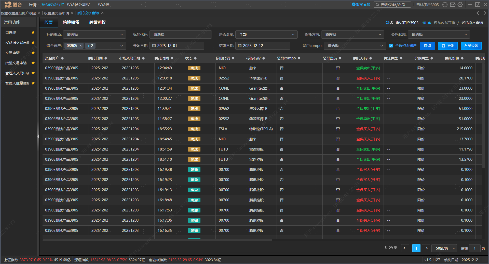

菜单：【权益收益互换】-【委托流水查询】

用于筛选查询单产品相关委托流水。

**操作说明：**

*   标的市场和资金账户可多选；
*   标的代码等参数留空表示不对该参数进行筛选；
*   点击查询按钮进行筛选查询;
*   点击导出按钮，会导出当前查询结果并下载到本地。

管理人委托流水查询
---------

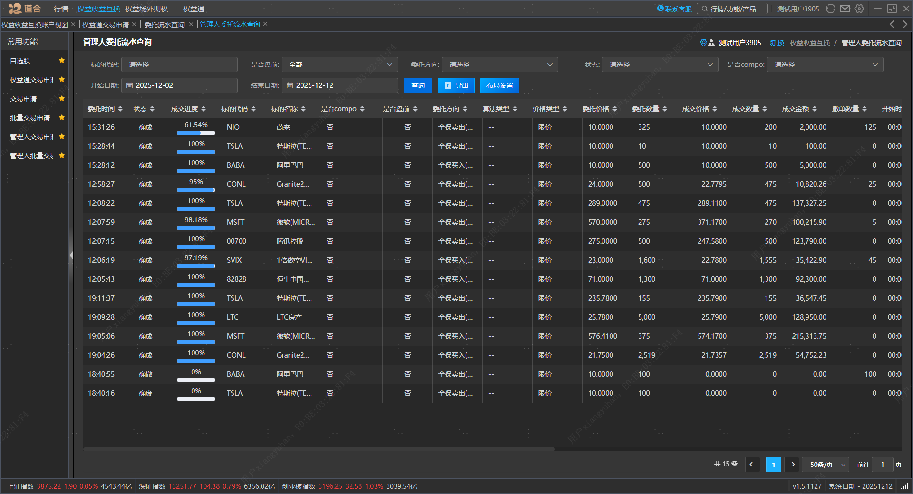

菜单：【权益收益互换】-【管理人委托流水查询】

用于筛选查询管理人相关委托流水。

**操作说明：**

*   标的代码等参数留空表示不对该参数进行筛选；
*   点击查询按钮进行筛选查询;
*   点击导出按钮，会导出当前查询结果并下载到本地。

权益通委托流水查询
---------

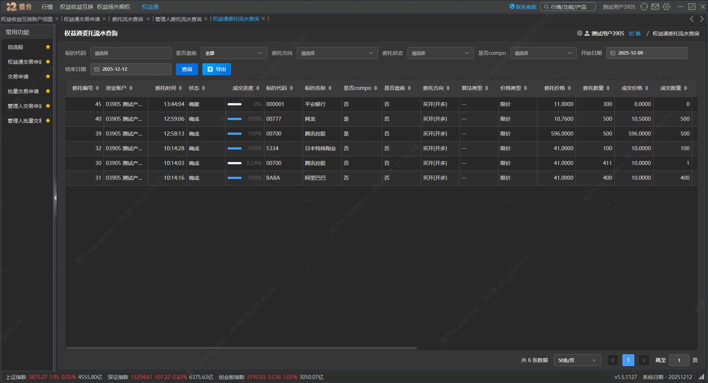

菜单：【权益通】-【权益通委托流水查询】

用于筛选查询权益通相关委托流水。

**操作说明：**

*   标的代码等参数留空表示不对该参数进行筛选；
*   点击查询按钮进行筛选查询;
*   点击导出按钮，会导出当前查询结果并下载到本地。

历史成交查询
------

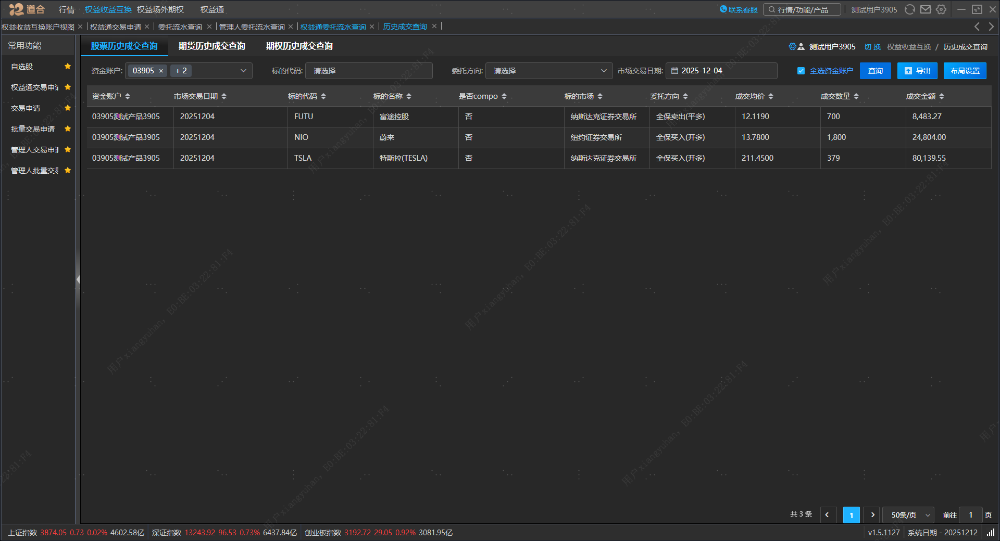

菜单：【权益收益互换】-【历史成交查询】

用于筛选查询单产品指定日历史成交情况。

**操作说明：**

*   切换上方tab，分别查询股票、期货、期权历史成交情况；
*   资金账户可多选；
*   标的代码等参数留空表示不对该参数进行筛选；
*   点击查询按钮进行筛选查询;
*   点击导出按钮，会导出当前查询结果并下载到本地。

管理人历史成交查询
---------

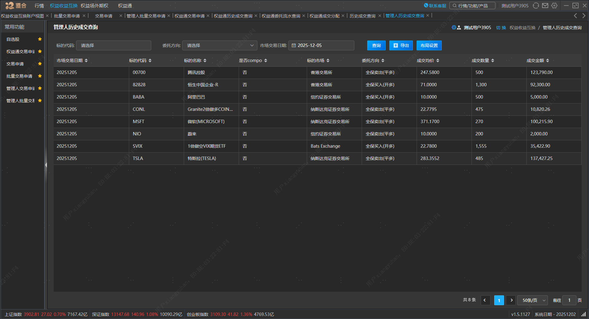

菜单：【权益收益互换】-【管理人历史成交查询】

用于筛选查询管理人指定日历史成交情况。

**操作说明：**

*   标的代码等参数留空表示不对该参数进行筛选；
*   点击查询按钮进行筛选查询;
*   点击导出按钮，会导出当前查询结果并下载到本地。

权益通历史成交查询
---------

菜单：【权益通】-【权益通历史成交查询】

用于筛选查询权益通指定日历史成交情况

**操作说明：**

*   标的代码等参数留空表示不对该参数进行筛选；
*   点击查询按钮进行筛选查询;
*   点击导出按钮，会导出当前查询结果并下载到本地。

持仓合约查询
------

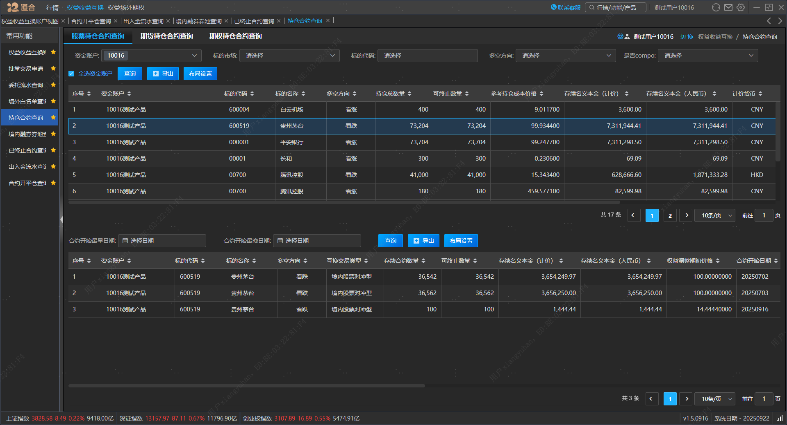

菜单：【权益收益互换】-【持仓合约查询】

用于筛选查询汇总持仓及各产品持仓明细。

持仓合约查询界面分为上下两个区域：

*   上方账户查询区：按资金账户、标的市场等参数进行筛选查询
*   下方合约查询区：按照时间对合约进行筛选查询

**操作说明：**

*   在上方账户查询区输入资金账户、标的市场等参数，点击查询；
*   双击上方表格中的某一行，将在下方显示该项对应的具体合约；

已终止合约查询
-------

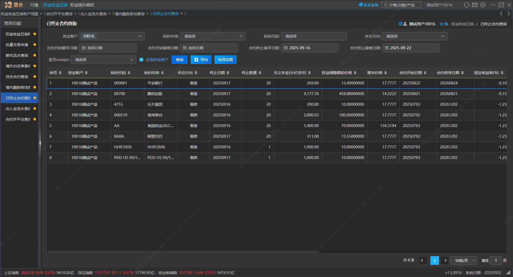

菜单：【权益收益互换】-【已终止合约查询】

用于筛选查询已终止合约相关信息。

**操作说明：**

*   输入资金账户、标的市场等参数，点击查询；
*   点击导出按钮，会导出当前查询结果并下载到本地。

境外白名单查询
-------

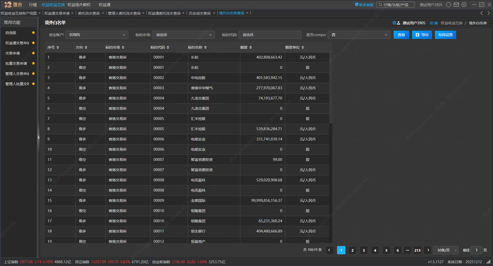

菜单：【权益收益互换】-【境外白名单查询】

境外白名单查询界面显示境外标的额度情况，每个标的根据方向单独显示。额度控制方面，看多对可交易金额额度（元/人民币）进行控制，看空对可融券数量额度（股）进行控制。

**操作说明：**

*   输入资金账户、标的市场、标的代码等参数，点击查询；
*   点击导出按钮，会导出当前查询结果并下载到本地。

境内融券券池查询
--------

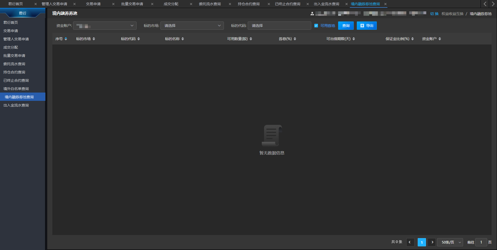

菜单：【权益收益互换】-【境内融券券池查询】

境内融券券池查询界面显示境内标的额度情况。

**操作说明：**

*   输入资金账户、标的市场等参数，点击查询；
*   点击导出按钮，会导出当前查询结果并下载到本地；
*   默认勾选可用券池，可用券池会过滤掉数量小于100股的标的。

出入金流水查询
-------

菜单：【权益收益互换】-【出入金流水查询】

用于筛选查询出入金流水相关信息。

**操作说明：**

*   输入资金账户、资金类型等参数，点击查询；
*   点击导出按钮，会导出当前查询结果并下载到本地。

合约开平仓查询
-------

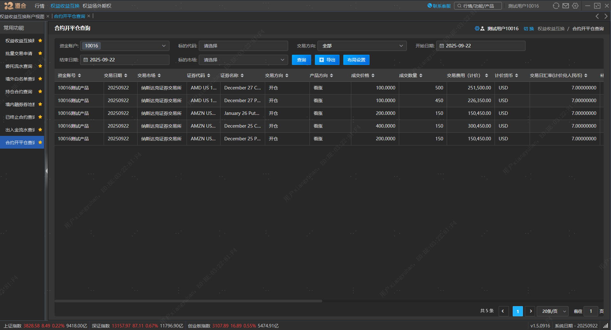

菜单：【权益收益互换】-【合约开平仓查询】

合约开平仓查询界面用于筛选查询合约层面的开平仓相关信息。

**操作说明：**

*   输入资金账户、标的代码等参数，点击查询；
*   打开菜单默认查询当天数据，若需查询全部数据请删除日期参数值。
*   点击导出按钮，会导出当前查询结果并下载到本地。